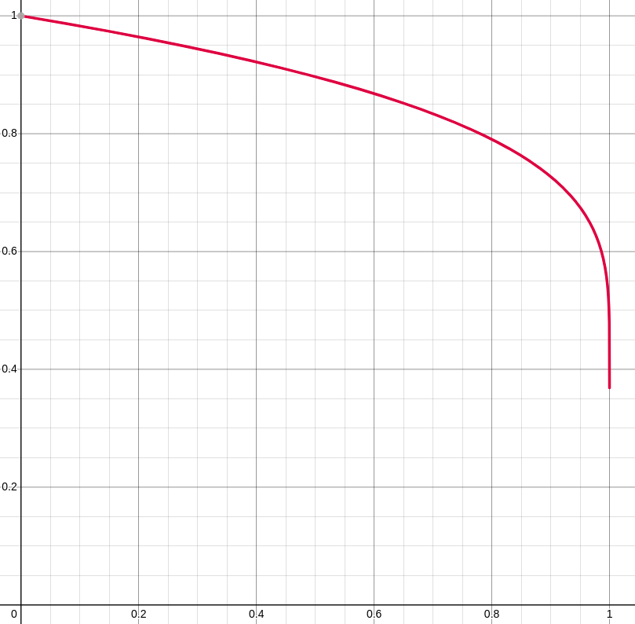
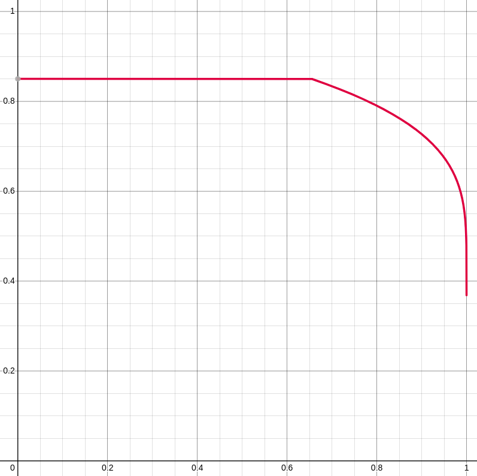

# Slamma - An Automated Negotiation Agent

**Aakash Aanegola**

## Overview

Our agent utilizes a multitude of strategies to converge to a favorable agreement quickly while behaving in a preference profile agnostic manner. We utilize the following components: 

- A **boulware curve** that computes the current desired utility - offers are only accepted if they are greater than this boundary and offers made are close to the boundary.
- A **softmax based opponent model** that is used to rank bids that are in the desirable range - the agent tries to offer the best utility to the opponent while meeting its own criteria.
- A **concession abuse protocol** that uses knowledge of the opponent being likely to concede in later rounds to try and maximize the utility obtained.

In following sections we elaborate on each of these components. 

## Boulware Negotiator

A boulware curve is one that follows the philosophy of remaining “bullish” early on and conceding closer to the deadline. We decided to use this curve as it performs better against conceder models (models that follow the opposite philosophy and concede early on) and holds its ground against other boulware models. 

$$
u_{des}(t) = \exp{\left(\left(\frac{t_{tot}-t}{t_{tot}}\right)^{\frac{1}{6}}-1\right)}
$$

This function was arrived at after a lot of tweaking, and we chose it due to its near linear early negotiation concessions and the gradual to sharp dropoff as the negotiation draws closer to the end. 

Boulware negotiation curve - used to produce offers

Based on our experimentation, we found that a lot of preference profiles aren’t very well correlated, and finding offers that have high utility for both parties is difficult. Since our curve starts from the maximum utility possible, it may miss out on offers that would’ve been significantly better than the eventual agreement point, but worse than the desired utility during the early negotiation stage. To remedy this we cap the maximum utility that the agent expects at 0.85 in order to ensure that we maximize the utility obtained, exploiting the lack of correlation between preference profiles. This only changes the acceptance protocol, but the offer protocol remains the same (depends on the uncapped curve). This difference ensures that our agents offers are the best they can be, but the agent will settle for lower utilities from other agents. 

The acceptance protocol also requires a lower bound, and if an offer is better than this bound ($0.5$ in our case) the agent accepts with $\frac{1}{4}$ probability. 

Acceptance strategy boulware curve

To select bids based on this curve, we take $u_{des}(t) \pm 0.05$ and search for offers that lie in that range. We then use the opponent model to rank the bids that lie within the range and offer the best one found. If no bid exists in the range (which is possible based on the preference profile) the next best bid (irrespective of the opponent model) is offered. We found that using this strategy without the range and opponent model led to repeated bids due to the strict nature of the $u_{des}$ curve, and integrated the opponent model to remedy this issue.

## Opponent Model

The opponent model is composed of three primary parts that in conjunction provide an estimate of the utility that the opponent will receive from the offer. The opponent model is based purely on what the opponents offer as the agent lacks access to the opponents preference profile during a negotiation. 

### Memory

Whenever the agent receives a bid, it adds it to it’s “memory” in the following manner: 

- Break the offer down into its issue-value pairs
- For each issue, increase the value counter by 1

From an implementation perspective, this is stored in an array of hashmaps referred to as `issueValueMap`. We also utilize a list of all the issues being negotiated on in order to map from the issue name to the index that we utilize. 

### Issue Importance Computation

Computing how much the opponent values each issue is a little more difficult than finding out how they rank values and we present our rationale behind computing issue importance. 

- Since all issues are negotiated on in every offer, it is difficult to identify which issues are more important to the opponent than others.
- Opponents are likely to be stubborn about issues that are important to them by repeatedly offering the same value for them while trying to negotiate values for other issues.
- It is unnecessary to condition the opponents offered value per issue on our offer as for issues that are important to them, their offer will most likely be independent of ours.

Using the above observations, we developed the following formulation for issue importance: 

$$
IV_{i} = \frac{\exp\left(\max_{v^i_j} freq(v^i_j)\right)}{\sum_{i}\exp\left(\max_{v^i_j} freq(v^i_j)\right)}
$$

Where $i$ represents an issue, and $v^i_j$ represents the $j^{th}$ value of the issue. The exponential function was arrived at experimentally, and follows the softmax formulation popular in the deep learning community. This increases the weight given to issues where the opponent doesn’t budge exponentially with respect to the other issues which performed better than simple weighting empirically. 

### Value Importance Computation

The value importance is computed in a similar fashion to the issue importance and uses the same softmax formulation, but this time over only the values of a particular issue. 

$$
v_j^i = \frac{\exp \left(freq(v_j^i)\right)}{\sum_j\exp\left(freq(v_j^i)\right)}
$$

As in the case of issue importance, the exponential function was arrived at empirically. 

**********************************Why exponential?**********************************

Assume the following distribution of values $[1, 1, 1, 1, 1, 3]$ for different values within an issue. If we consider a linear weighting method, our weights would be $[\frac{1}{8}, \frac{1}{8}, \frac{1}{8}, \frac{1}{8}, \frac{3}{8}]$. Intuitively, the opponent seems to tend to the last value more than the others, and we should assign that value a much higher weight than the others. This is to ensure that we always try to find the best possible utility for the opponent (note that these weights don’t contain issue importance) based on our knowledge of their offers. 

### Offer Utility Computation

The standard utility computation in the GENIUS library is to compute the utility based on the preference profile (by multiplying issue importance with the value numeric value provided) for every valid offer, and max-normalize them (divide all of the utilities by the max to obtain a number between 0 and 1 for every offer). Max normalization doesn’t change the relative ordering of different utilities but rather gives a better estimate to the agent as to how good an offer really is, as it is much easier to compare in the normalized utility space. 

Since our goal is to compute the relative “rank” of the offers, it doesn’t make much sense to invest precious time to compute each of the offer utilities (this can’t be run as a precomputation step as the opponent model is learnt over the course of the negotiation) and normalizing the offer values doesn’t change the relative ranks of the offers. 

$$
u_o = \sum_i IV_i \cdot v_j^i
$$

where $u_o$ is the utility of the offer and is equal to the sum of the issue importance multiplied with the value importance for all issues being negotiated on. These values are used in order to compute the best offer for the opponent (from a sample set) which are then used by the agent based on its offer protocol. 

## Concession Abuse Protocol

It is in every agent’s best interest to concede and accept a lower utility to obtain a better deal as the negotiation progresses, as the utility of not reaching an agreement is $0$ (or can be set to a disagreement point which is usually lower than the utility of reaching some agreement). In order for our agent to make the most of this heuristic (assuming that opponents concede and settle for offers that may not be as optimal), we divide our negotiation into three phases based on which the offer protocol is defined. For the early and mid negotiation phases, the offers follow the boulware curve and the agent tries to offer the opponent the best possible utility while ensuring that the offer is close to the desired utility. In the late negotiation phase, the agent may randomly offer a bid that is in the top $5$ (if there aren’t $5$ bids then it selects from the top $k$ where $k$ is the number of bids itself) in the hopes that the opponent is conceding and may end up accepting one of the bids even if it is less appealing than some other bid due to their acceptance protocol.